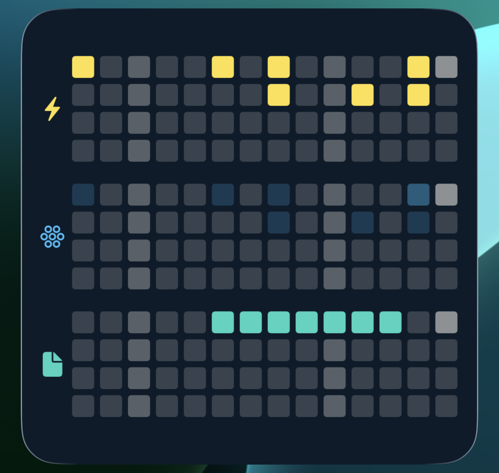
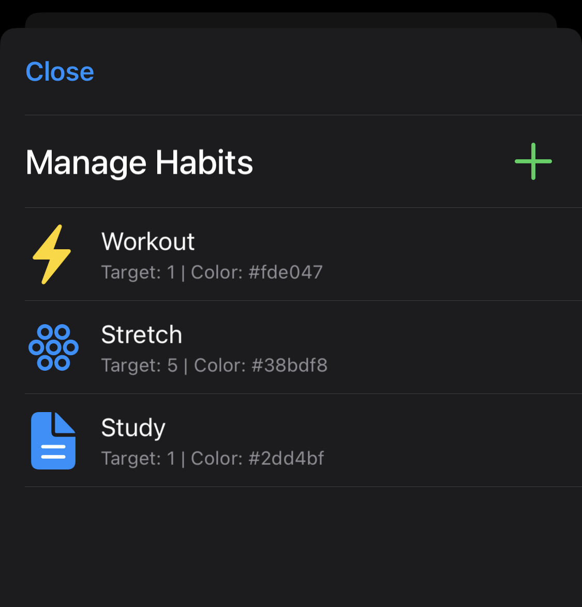

# iOS Habit Tracker via Scriptable

**Version 2.0 (Fork)**

> This project is a major overhaul of the original text-based tracker. Huge
> thanks to [anviqs](https://github.com/anviqs) for the original work!

A powerful, interactive, and aesthetic habit tracker for iOS built with
[Scriptable](https://scriptable.app/).

## What's New in v2.0

- **Improved flexibility**: No restrictions on the number of habits. You can
  track 1 or 100!
- **Continuous History**: No more monthly resets. Data is stored permanently in
  JSON. Feel free to do with the file as you please.
- **Admin UI**: Manage habits via native iOS menus. Add, delete, edit, and
  change colors and icons.
- **Adaptive Heatmaps**: The widget heatmaps will change in size and layout
  depending on the number of habits and size of the widget. Allowing you to see
  more history for fewer habits, or less history for more habits.
- **Tap-to-Log**: Configure the script widget to track a habit or open the menu.
- **Shortcuts Support**: Want to track your habits with one tap? Setup separate
  Shortcuts for each habit to log them instantly!

## Layout & Themes

The widget adapts its layout automatically:

- **Small Widget**: Up to 6 habits with rows of 5 days.
- **Medium Widget**: Up to 6 habits, with rows of 14 days. Switching between
  detailed heatmaps and compact rows.
- **Large Widget**: Up to 12 habits with rows of 14 days. Massive history views.

### Included Themes

Retained the beautiful color palettes from the original:

- **Classic Dark** / **Light**
- **Midnight Blue**
- **Solarized Dark**
- **Nordic Night**
- **Paper White**
- **Sweet Pink**

## Setup Instructions

1. **Install Scriptable**: Download
   [Scriptable](https://apps.apple.com/us/app/scriptable/id1405459188).
2. **Install the Script**:
   - Create a new script named `Habit Tracker`.
   - Paste the code from `CODE`.
3. **Run Once**:
   - Run the script inside the app once to initialize the data and open the
     **Admin Menu**.
   - Use the menu to add your habits.
4. **Add Widget**:
   - Add a Scriptable widget to your Home Screen.
   - Select the `Habit Tracker` script.
   - **Important**: Set "When Interacting" to "Run Script" to enable
     tap-to-increment.

## Automating with Shortcuts

You can log habits via Apple Shortcuts:

1. Add a **Text** action and type your habit name (e.g., `Water`).
2. Add a **Run Script** action (from Scriptable).
3. Select your `Habit Tracker` script.
4. The text variable will be automatically selected.
5. Recommended: Add the **Refresh all widgets** action.

_Note: It is recommended to use a Text action first, as typing directly into the
Parameter field can be glitchy on some iOS versions._

## Credits

- **Original Concept**:
  [James Scholz](https://www.youtube.com/channel/UCMOqf8ab-42UUQIdVoKwjlQ)
- **Original Script:** [anviqs](https://github.com/anviqs)

## License

This project is licensed under the **Creative Commons Attribution-NonCommercial
4.0 International License (CC BY-NC 4.0)**.

**You are free to:**

- **Share** — copy and redistribute the material in any medium or format.
- **Adapt** — remix, transform, and build upon the material.

**Under the following terms:**

- **Attribution** — You must give appropriate credit to the original creators.
- **NonCommercial** — You may not use this material for commercial purposes.
